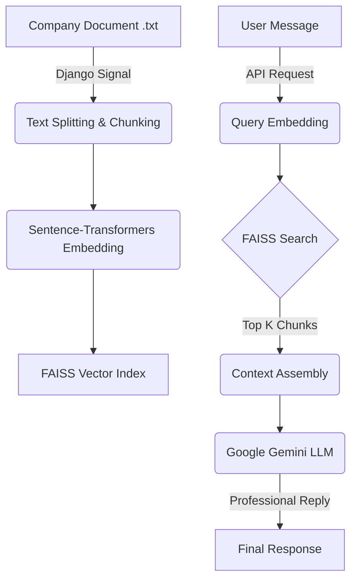

# SaaS AI ChatBot - Advanced with Memory (RAG)


A professional, multi-tenant SaaS ChatBot system designed for businesses to provide AI-powered customer support using their proprietary knowledge. Built with a **Retrieval-Augmented Generation (RAG)** architecture, it ensures high accuracy by grounding LLM responses in company-specific documents.

---

## 📐 Architecture Overview

The system follows a modern RAG pipeline where company data is processed into searchable vectors.



---

## 🚀 Key Features

- **Multi-Tenant Data Isolation**: Separate FAISS indices and storage paths for every company code.
- **Real-time Indexing**: Automated vector synchronization via Django Signals (`post_save`) when documents are updated.
- **Smart RAG Pipeline**:
  - **Chunking**: Intelligent text splitting with overlap to maintain context.
  - **Embeddings**: Utilizes `all-MiniLM-L6-v2` for efficient and accurate semantic representation.
  - **Vector Search**: sub-millisecond similarity search using FAISS.
- **LLM Context Injection**: Dynamic prompt engineering with fallback logic (e.g., default working hours).
- **Comprehensive Admin Dashboard**: Manage companies, API tokens, and Gemini configurations in one place.

---

## 🛠️ Technology Stack

| Component         | Technology            | Description                                            |
| :---------------- | :-------------------- | :----------------------------------------------------- |
| **Backend**       | Django                | Robust web framework for multi-tenant management.      |
| **API**           | Django REST Framework | Clean, scalable RESTful endpoints.                     |
| **Embeddings**    | Sentence-Transformers | Local embedding generation (no API cost).              |
| **Vector Engine** | FAISS                 | Facebook's high-performance similarity search.         |
| **LLM**           | Google Gemini         | State-of-the-art generative AI for human-like replies. |
| **Storage**       | SQLite + Local FS     | Simplified file and vector storage management.         |

---

## 📂 Project Structure

```text
├── chatapp/                # Core AI logic
│   ├── faiss_engine.py     # Data splitting, indexing, and search
│   ├── gemini_llm.py       # Integration with Google Generative AI
│   ├── nlp.py              # Embedding model loader
│   ├── intent.py           # (Experimental) Intent detection
│   ├── formatter.py        # Response cleaning & intro generation
│   └── views.py            # API controller (ChatAPIView)
├── companies/              # Tenant management
│   ├── models.py           # Company and GeminiConfig definitions
│   └── signals.py          # Post-save hooks for automated indexing
├── data/                   # Dynamic storage
│   ├── txt/                # Uploaded company knowledge base
│   └── vectors/            # Generated .index and _chunks.txt files
├── chatbot/                # Project configuration
└── manage.py               # Entry point
```

---

## ⚙️ Setup & Installation

### Prerequisite

- Python 3.9 or higher
- [Google AI Studio API Key](https://aistudio.google.com/app/apikey)

### 1. Environment Preparation

```bash
# Clone the repository
git clone <repository-url>
cd chatbot

# Create and activate environment
python -m venv venv
venv\Scripts\activate  # Windows
source venv/bin/activate  # Linux/Mac
```

### 2. Dependency Installation

```bash
pip install django djangorestframework django-cors-headers faiss-cpu sentence-transformers google-generativeai numpy
```

### 3. Deployment Steps

```bash
# Initialize Database
python manage.py makemigrations
python manage.py migrate

# Create your admin account
python manage.py createsuperuser

# Start the application
python manage.py runserver
```

---

## 🤖 Administrative Workflow

### 1. Configure the Brain (Gemini)

1. Go to `http://127.0.0.1:8000/admin/`.
2. Locate **Gemini Configs** and click "Add".
3. Paste your API Key and set the model to `gemini-2.0-flash`.
4. Ensure **Active** is checked.

### 2. Onboard a New Client

1. Under **Companies**, add a new entry.
2. Upload a text file (e.g., `services_info.txt`).
3. Define a `Code` (e.g., `TECH_01`) and an `API Token`.
4. **Note**: On saving, check the `data/vectors/` folder. You should see `TECH_01.index` and `TECH_01_chunks.txt` created instantly.

---

## 📡 API Reference

### Send Chat Message

**Endpoint**: `POST /api/chat/`  
**Authentication**: Token-based (handled via payload)

#### Request Example (cURL)

```bash
curl -X POST http://127.0.0.1:8000/api/chat/ \
-H "Content-Type: application/json" \
-d '{
  "company_code": "ALG01",
  "api_token": "your_secure_token",
  "message": "What is your office address?"
}'
```

#### Request Example (JavaScript)

```javascript
const response = await fetch("http://127.0.0.1:8000/api/chat/", {
  method: "POST",
  headers: { "Content-Type": "application/json" },
  body: JSON.stringify({
    company_code: "ALG01",
    api_token: "your_secure_token",
    message: "Tell me about your services",
  }),
});
const data = await response.json();
console.log(data.reply);
```

---

## 🔧 Troubleshooting

| Issue                     | Potential Cause                      | Solution                                                                                                        |
| :------------------------ | :----------------------------------- | :-------------------------------------------------------------------------------------------------------------- |
| **401 Unauthorized**      | Incorrect Token or Code              | Verify the `api_token` and `company_code` match exactly in the Admin panel.                                     |
| **FAISS Index Not Found** | Signal failure or folder permissions | Manually re-save the Company object in Admin to trigger the signal again. Ensure `data/vectors/` is writable.   |
| **Gemini Error**          | Invalid API Key or Quota             | Check the **Gemini Config** in Admin. Ensure the key is valid and you have remaining quota in Google AI Studio. |
| **Slow First Response**   | Model Loading                        | The embedding model loads on the first request. Subsequent requests will be much faster.                        |

---

## 📝 Authors & License

- **Developed by**: Algorytham Technologies Pvt. Ltd.
- **Maintained for**: AI SaaS Solutions.
